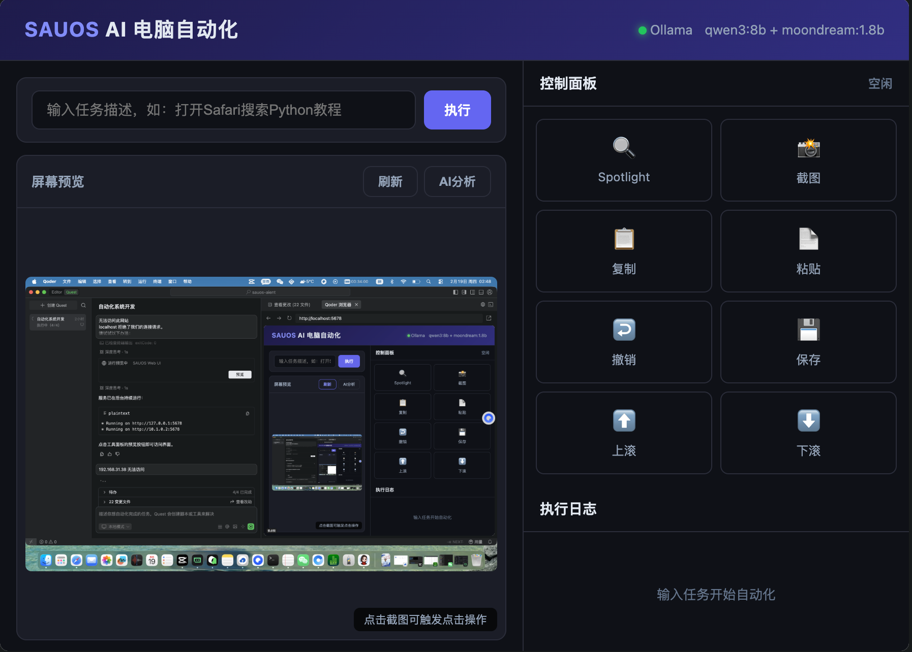

# SAUOS

**Screen Automation Universal Operating System**

[](https://opensource.org/licenses/MIT)
[](https://www.python.org/downloads/)
[](https://sauos-aient.sauos.net)

**Website / 官网**: [https://sauos-aient.sauos.net](https://sauos-aient.sauos.net)



---

[中文](#中文) | [English](#english) | [日本語](#日本語) | [한국어](#한국어) | [Deutsch](#deutsch) | [Русский](#русский)

---

## 中文

### AI驱动的智能桌面自动化系统

SAUOS 通过大语言模型和视觉理解能力，让计算机像人一样"看"屏幕、"理解"界面、"执行"操作，实现自然语言驱动的计算机操作自动化。

#### 核心特性
- **视觉理解** - 实时截屏分析，精准识别UI元素、文本内容、按钮位置
- **智能决策** - 基于LLM的任务规划，自动分解复杂操作步骤
- **精准操控** - 鼠标点击/拖拽、键盘输入、热键组合、窗口管理
- **多模型支持** - OpenAI、Claude、阿里百炼、DeepSeek等8+大模型一键切换
- **私有部署** - 支持Ollama本地模型，数据不出企业内网

#### 快速开始
```bash
git clone https://github.com/sauos-dev/sauos-aient.git
cd sauos-aient
pip install -r requirements.txt
python web.py  # Web界面 http://localhost:5678
```

---

## English

### AI-Powered Intelligent Desktop Automation System

SAUOS enables computers to "see" screens, "understand" interfaces, and "execute" operations like humans, achieving natural language-driven computer automation through large language models and visual understanding capabilities.

#### Core Features
- **Visual Understanding** - Real-time screen analysis, accurate recognition of UI elements, text content, and button positions
- **Intelligent Decision Making** - LLM-based task planning, automatic decomposition of complex operations
- **Precise Control** - Mouse clicking/dragging, keyboard input, hotkey combinations, window management
- **Multi-Model Support** - One-click switching between 8+ LLMs including OpenAI, Claude, Alibaba Bailian, DeepSeek
- **Private Deployment** - Support for Ollama local models, data never leaves your network

#### Quick Start
```bash
git clone https://github.com/sauos-dev/sauos-aient.git
cd sauos-aient
pip install -r requirements.txt
python web.py  # Web UI http://localhost:5678
```

---

## 日本語

### AI駆動のインテリジェントデスクトップ自動化システム

SAUOSは大規模言語モデルと視覚理解機能を活用し、コンピュータが人間のように画面を「見て」、インターフェースを「理解し」、操作を「実行」することを可能にします。

#### 主な機能
- **視覚理解** - リアルタイム画面分析、UI要素・テキスト内容・ボタン位置の正確な認識
- **インテリジェント判断** - LLMベースのタスク計画、複雑な操作の自動分解
- **精密制御** - マウスクリック/ドラッグ、キーボード入力、ホットキー、ウィンドウ管理
- **マルチモデル対応** - OpenAI、Claude、阿里百炼、DeepSeekなど8種類以上のLLMをワンクリックで切り替え
- **プライベート展開** - Ollamaローカルモデルに対応

#### クイックスタート
```bash
git clone https://github.com/sauos-dev/sauos-aient.git
cd sauos-aient
pip install -r requirements.txt
python web.py  # Web UI http://localhost:5678
```

---

## 한국어

### AI 기반 지능형 데스크톱 자동화 시스템

SAUOS는 대규모 언어 모델과 시각적 이해 기능을 활용하여 컴퓨터가 사람처럼 화면을 "보고", 인터페이스를 "이해하고", 작업을 "실행"할 수 있게 합니다.

#### 핵심 기능
- **시각적 이해** - 실시간 화면 분석, UI 요소, 텍스트 내용, 버튼 위치의 정확한 인식
- **지능적 의사결정** - LLM 기반 작업 계획, 복잡한 작업의 자동 분해
- **정밀 제어** - 마우스 클릭/드래그, 키보드 입력, 단축키 조합, 창 관리
- **다중 모델 지원** - OpenAI, Claude, 알리바바 바이리안, DeepSeek 등 8개 이상의 LLM 원클릭 전환
- **프라이빗 배포** - Ollama 로컬 모델 지원

#### 빠른 시작
```bash
git clone https://github.com/sauos-dev/sauos-aient.git
cd sauos-aient
pip install -r requirements.txt
python web.py  # Web UI http://localhost:5678
```

---

## Deutsch

### KI-gestütztes intelligentes Desktop-Automatisierungssystem

SAUOS ermöglicht Computern durch große Sprachmodelle und visuelle Verständnisfähigkeiten, Bildschirme zu "sehen", Oberflächen zu "verstehen" und Operationen wie Menschen "auszuführen".

#### Kernfunktionen
- **Visuelles Verständnis** - Echtzeit-Bildschirmanalyse, präzise Erkennung von UI-Elementen, Textinhalten und Schaltflächenpositionen
- **Intelligente Entscheidungsfindung** - LLM-basierte Aufgabenplanung, automatische Zerlegung komplexer Operationen
- **Präzise Steuerung** - Mausklicks/Ziehen, Tastatureingabe, Hotkey-Kombinationen, Fensterverwaltung
- **Multi-Modell-Unterstützung** - Ein-Klick-Wechsel zwischen 8+ LLMs einschließlich OpenAI, Claude, Alibaba Bailian, DeepSeek
- **Private Bereitstellung** - Unterstützung für Ollama lokale Modelle

#### Schnellstart
```bash
git clone https://github.com/sauos-dev/sauos-aient.git
cd sauos-aient
pip install -r requirements.txt
python web.py  # Web UI http://localhost:5678
```

---

## Русский

### Интеллектуальная система автоматизации рабочего стола на базе ИИ

SAUOS позволяет компьютерам "видеть" экраны, "понимать" интерфейсы и "выполнять" операции как люди, используя большие языковые модели и возможности визуального понимания.

#### Основные функции
- **Визуальное понимание** - Анализ экрана в реальном времени, точное распознавание элементов UI, текста и кнопок
- **Интеллектуальное принятие решений** - Планирование задач на основе LLM, автоматическая декомпозиция сложных операций
- **Точное управление** - Клики/перетаскивание мыши, ввод с клавиатуры, горячие клавиши, управление окнами
- **Поддержка нескольких моделей** - Переключение между 8+ LLM включая OpenAI, Claude, Alibaba Bailian, DeepSeek
- **Частное развертывание** - Поддержка локальных моделей Ollama

#### Быстрый старт
```bash
git clone https://github.com/sauos-dev/sauos-aient.git
cd sauos-aient
pip install -r requirements.txt
python web.py  # Web UI http://localhost:5678
```

---

## Supported AI Models / 支持的AI模型

| Provider | Models |
|----------|--------|
| OpenAI | GPT-4o, GPT-4-turbo |
| Claude | claude-3.5-sonnet |
| 阿里百炼 | qwen-max, qwen-vl |
| DeepSeek | deepseek-chat |
| 智谱AI | glm-4 |
| MiniMax | abab6.5s-chat |
| 火山引擎 | doubao-pro |
| Moonshot | moonshot-v1-8k |
| Ollama | Local deployment |

## Tech Stack / 技术栈

- **Language**: Python 3.9+
- **Screen**: MSS, PyAutoGUI
- **Image**: OpenCV, Pillow, NumPy
- **AI**: httpx
- **Web**: Flask

## License

MIT License
